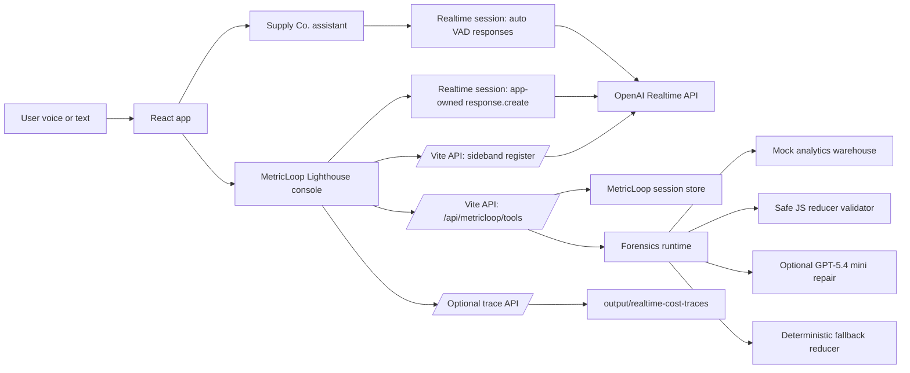
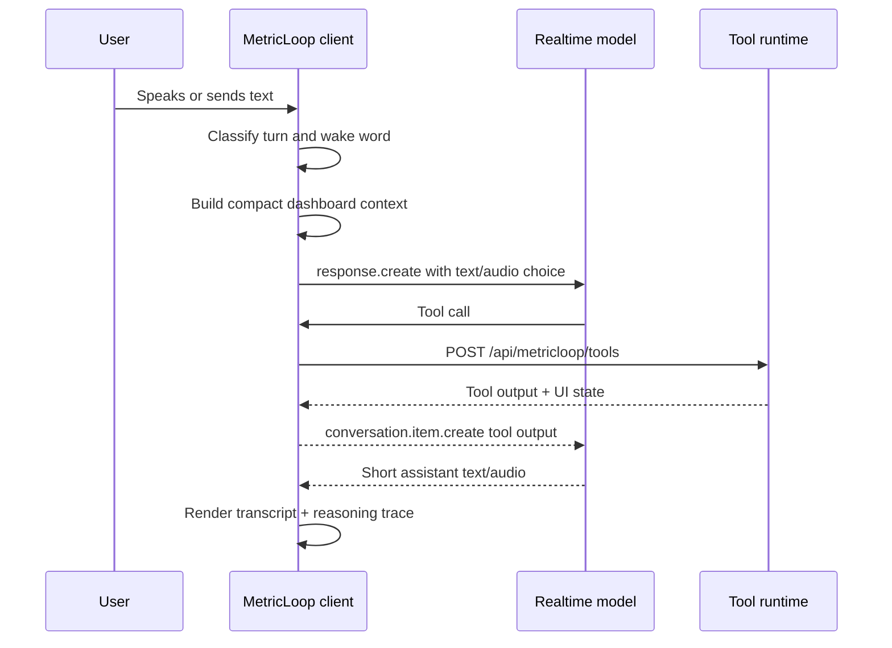
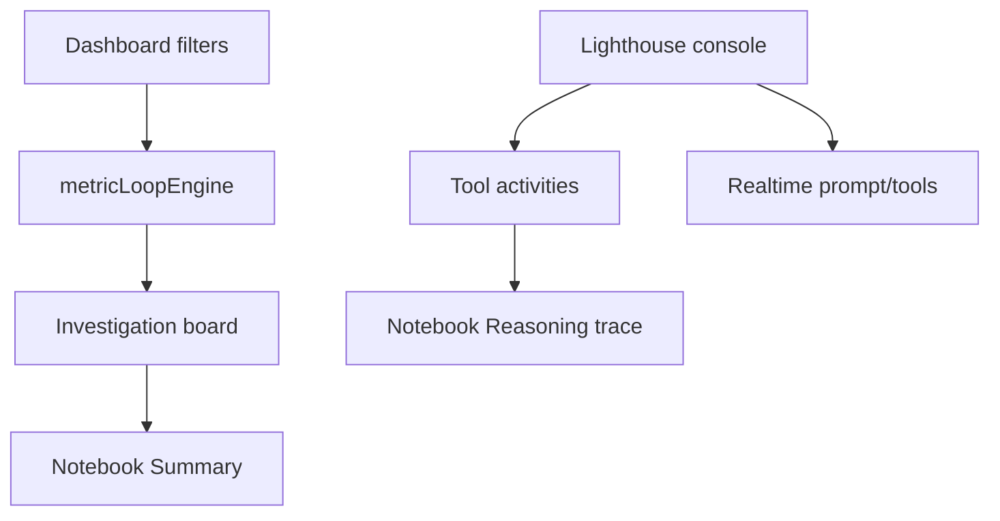
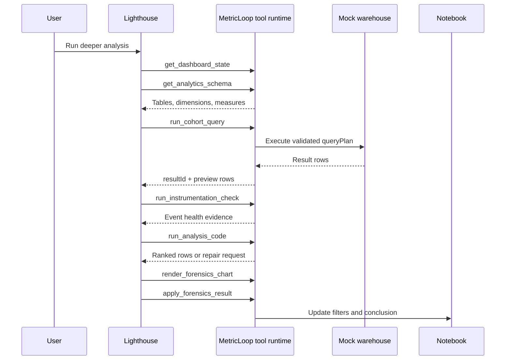
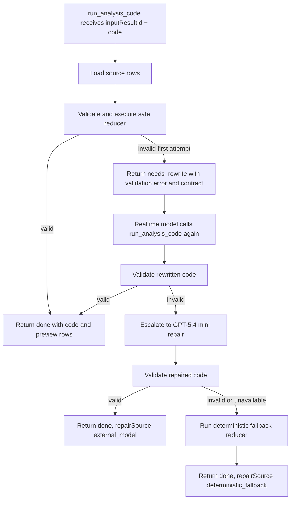

# Realtime 2 Demos

Voice-to-action demos for ecommerce and product analytics.

This repo contains two realtime demo applications for Supply Co.:

- **Supply Co.**: an ecommerce storefront with a realtime shopping assistant.
- **MetricLoop**: a product analytics dashboard with a realtime analyst named Lighthouse.

The demos share one React/Vite app and one local server layer, but they intentionally show two different realtime product patterns:

- Supply Co. optimizes for low-latency conversational shopping.
- MetricLoop optimizes for app-owned analytics state, inspectable tool work, server-side forensics tools, and reliable model-assisted investigation.

## Quick Start

```bash
npm install
npm run dev
```

Open:

- Supply Co.: `http://127.0.0.1:5173/`
- MetricLoop: `http://127.0.0.1:5173/metricloop`

Build and test:

```bash
npm test
npm run build
```

The project uses a local `.env` for secrets. Start from `.env.example` and set:

```bash
OPENAI_API_KEY=...
```

Optional settings:

- `OPENAI_SAFETY_IDENTIFIER`: stable, non-PII identifier sent as the `OpenAI-Safety-Identifier` header when the server creates Realtime client secrets.
- `ENABLE_REALTIME_COST_TRACES=1`: enables local Realtime usage trace persistence under `output/realtime-cost-traces`.

Do not commit `.env`. The repo intentionally ignores local env files, build output, screenshots, dependencies, and generated runtime traces.

## What This Repo Demonstrates

### Supply Co.

Supply Co. is the ecommerce side of the demo. It shows a customer using voice to shop for outdoor products.

The assistant can:

- Search and filter products.
- Highlight products.
- Open product detail pages.
- Select size options and open or close the size guide.
- Add products to cart.
- Review cart state.
- Fetch weather context for trip-risk follow-ups.
- Maintain a conversational voice experience.

Supply Co. is intentionally simpler than MetricLoop, but it is not just a static shopping bot. It demonstrates a voice agent that can combine storefront state with external context. The key example is the `search_weather_web` tool: if the shopper asks whether a tent is storm-proof enough for a Seattle trip, the assistant can check the forecast, compare the storm risk against known product concerns, and recommend whether the current tent is good enough, needs add-ons, or should be swapped for a more storm-ready option.

That makes Supply Co. useful as the first half of the demo story:

- The user starts with a natural shopping request.
- The assistant operates the UI through tools.
- The assistant can bring in live context beyond the page, such as weather.
- The storefront interaction later becomes the product analytics story in MetricLoop.

### MetricLoop

MetricLoop is the analytics side of the demo. It shows a PM, founder, or engineer asking Lighthouse to investigate an activation drop.

Lighthouse can:

- Apply dashboard filters.
- Open analytics panels.
- Compare periods.
- Generate a root-cause investigation notebook.
- Run cohort forensics.
- Write bounded analysis code over retrieved rows.
- Repair unsafe generated code.
- Render charts and update the notebook conclusion.
- Keep user/assistant transcript separate from the model work trace.

## Tech Stack

- **App shell:** React 19 + TypeScript
- **Bundler/server:** Vite 7
- **Tests:** Vitest
- **Realtime transport:** OpenAI Realtime API through local Vite middleware
- **MetricLoop server runtime:** Vite middleware for sideband registration, server-owned tool execution, and optional local trace persistence
- **Longer repair path:** Responses API call to `gpt-5.4-mini` for generated-code repair
- **Primary route files:** `src/App.tsx`, `src/main.tsx`
- **Supply Co. code:** `src/agent`, `src/data.ts`, `src/App.tsx`, `src/assets.ts`
- **MetricLoop code:** `src/metricloop`, `src/server/metricloop*`

## Repository Map

```text
25-realtime-2/
|-- README.md
|-- package.json
|-- vite.config.ts
|-- src/
|   |-- agent/                         # Supply Co. realtime assistant prompt + hook
|   |-- data.ts                        # Supply Co. product/catalog fixtures
|   |-- demoExperience.ts              # Demo profile and timing fixtures
|   |-- metricloop/                    # MetricLoop dashboard, prompt, notebook, console
|   |-- realtime/                      # Shared response controller + usage tracing
|   |-- server/                        # Vite middleware runtimes and MetricLoop tools
|   `-- realtimeSessionConfig.ts       # Shared Realtime session config builder
|-- docs/
|   `-- developer-architecture-diagrams.md
`-- public/
```

## High-Level Architecture



## Local Server Endpoints

The Vite plugin in `vite.config.ts` mounts the local API routes used by both demos.

| Endpoint | Purpose |
| --- | --- |
| `/api/realtime/client-secret` | Supply Co. Realtime client-secret helper. The current Supply Co. hook uses the local calls proxy. |
| `/api/realtime/calls` | Supply Co. WebRTC SDP exchange path using the server API key and Supply session config. |
| `/api/realtime/metricloop/client-secret` | MetricLoop ephemeral Realtime client secret with short expiry and safety identifier header. |
| `/api/realtime/metricloop/calls` | MetricLoop fallback WebRTC SDP exchange path if direct client-secret connection fails. |
| `/api/realtime/metricloop/sideband/register` | MetricLoop sideband registration path for attaching the server to the same Realtime call. |
| `/api/metricloop/tools` | Server-owned MetricLoop tool runtime. |
| `/api/realtime-cost-traces` | Optional local realtime usage trace persistence when `ENABLE_REALTIME_COST_TRACES=1`. |

## Realtime Response Ownership

The repo intentionally uses two response patterns.

### Supply Co.: Auto VAD Realtime Responses

Supply Co. is a shopping assistant. The UX goal is speed and natural conversation, so the Realtime session can create responses automatically after VAD detects the end of speech. The browser posts its SDP offer to the local `/api/realtime/calls` route, and the Vite middleware forwards the offer to `/v1/realtime/calls` with the Supply Co. session config.

This is the right shape when:

- The assistant is mostly conversational.
- The app does not need to decide text vs audio per turn.
- The model can call UI tools directly without a pre-response gate.
- Low latency matters more than app-owned turn validation.

### MetricLoop: App-Owned Realtime Responses

MetricLoop uses `turn_detection.create_response: false`. VAD still detects speech boundaries, but the app waits for the transcript, applies local policy, attaches compact dashboard context, and then sends `response.create`.

The browser first asks the local server for a short-lived Realtime client secret, connects directly to `/v1/realtime/calls`, and registers the call id back with the server so the sideband can attach. If that direct browser connection is unavailable, the app falls back to the local `/api/realtime/metricloop/calls` proxy. Tool execution still flows through `/api/metricloop/tools`, which keeps analytics and forensics work on the local server runtime.

This is the right shape because MetricLoop needs to decide before each response:

- Whether the turn should be silent action text or spoken audio.
- Whether the latest transcript contains the Lighthouse wake word.
- What compact dashboard state should be attached.
- Whether the app should ignore background/filler turns.
- How to keep the transcript clean while tool work appears in the workbench.



## MetricLoop Wake-Word Policy

MetricLoop treats spoken output as a UI policy, not only a prompt instruction.

- If the latest user turn includes `Lighthouse`, the app can request audio output.
- If the wake word is absent, Lighthouse should act silently and write concise text to the Action Console.
- The client also handles the likely split transcription `light house` when it clearly means the wake word.
- The prompt repeats the rule, but the client owns modality because output modality must be chosen before the response begins.

Wake-word eval coverage lives in `src/metricloop/voiceToActionPolicyEval.ts`.

## MetricLoop Dashboard Architecture

MetricLoop has three visible surfaces:

- **Dashboard:** filters, funnel, release correlation, browser breakdown, support tickets, session replay, search intent, and KPI cards.
- **Lighthouse console:** small right-side voice/text console with transcript and active tool status.
- **Investigation notebook:** right-side notebook rail with `Summary` and `Reasoning trace` tabs.

Normal root-cause investigation opens the notebook on **Summary**. Deeper forensics opens **Reasoning trace** so the model work is visible only when the demo is showing deeper reasoning.



## MetricLoop Prompt Review

The MetricLoop system prompt is in `src/metricloop/metricLoopPrompt.ts`.

It defines:

- **Role:** Lighthouse, a voice analyst inside MetricLoop for Supply Co.
- **Product context:** ecommerce activation investigation after a voice-search shopper gets stuck adding hiking boots to cart.
- **Voice-to-action policy:** default silent action mode, Lighthouse wake word for spoken replies.
- **Happy path:** filter, compare, check releases/support/replays, generate notebook, update notebook.
- **Tool policy:** use tools for dashboard operations and avoid claiming dashboard facts without state.
- **Cohort forensics policy:** use schema/query/instrumentation/code/chart/apply tools for hard proof-oriented questions.
- **Generated-code repair policy:** when `run_analysis_code` returns `needs_rewrite`, rewrite once using the safe contract and call the tool again.

The Supply Co. assistant prompt is in `src/agent/supplyPrompt.ts`. It defines the ecommerce shopping assistant behavior and the tools it can call to operate the storefront.

## MetricLoop Tool Catalog

MetricLoop exposes dashboard tools and forensics tools.

### Dashboard Tools

| Tool | Purpose |
| --- | --- |
| `get_dashboard_state` | Read current dashboard state. |
| `open_insight` | Navigate visible analytics panels. |
| `apply_filter` | Apply interaction, date, segment, region, browser, device, category, traffic, and paid-ad filters. |
| `set_breakdown` | Compare by browser, device, traffic source, or search term. |
| `compare_periods` | Compare current period with prior 7 days. |
| `check_release_notes` | Surface release correlation evidence. |
| `cluster_support_tickets` | Cluster support-ticket evidence. |
| `open_session_replay` | Open representative replay evidence. |
| `start_root_cause_investigation` | Generate the persistent notebook artifact. |
| `update_investigation_notebook` | Update the notebook after filters or conclusions change. |
| `no_op` | Explicitly ignore background/filler/unrelated turns. |

### Forensics Tools

| Tool | Purpose |
| --- | --- |
| `get_analytics_schema` | Read server-owned mock warehouse schema. |
| `run_cohort_query` | Execute a validated structured cohort query plan. |
| `run_instrumentation_check` | Compare event health, missing properties, and validation behavior. |
| `run_analysis_code` | Validate and run generated JS reducer code over prior result rows. |
| `render_forensics_chart` | Render an inspectable chart artifact from a prior result. |
| `apply_forensics_result` | Apply the highest-signal result to dashboard filters and update the notebook. |

## MetricLoop Forensics Flow

The broad `Run deeper analysis` CTA sends one proof-oriented prompt. It does not literally click all targeted chips. It asks Lighthouse to use the full forensics sequence to prove or weaken the current hypothesis.



Targeted chips run narrower follow-ups:

| CTA | Bias |
| --- | --- |
| `Run deeper analysis` | Broad proof path: cohort query, acquisition confounder, instrumentation, generated code, chart, conclusion update. |
| `Rank impacted cohorts` | Cohort query + generated code to rank contribution. |
| `Test acquisition mix` | Traffic source / paid-ad confounder checks. |
| `Check instrumentation` | Event health and validation-state checks. |
| `Build chart` | Chart artifact from latest or newly queried result. |

## Generated Code Repair Flow

The generated-code path is designed to be reliable enough for a public demo while preserving the architecture story. It is not a production sandbox pattern:

**Realtime model writes analysis code -> app validates it -> realtime model repairs once -> server escalates to GPT-5.4 mini if needed -> app validates again -> deterministic fallback protects reliability.**



The demo reducer contract lives in `src/server/metricloopSafeCodeRunner.ts`. It constrains what the demo will execute, but production systems should use a real sandbox or avoid model-generated code execution.

Generated code may:

- Read from `rows` or `input.rows`.
- Use `const` and `let`.
- Use local helper functions that operate only on row data.
- Use `map`, `filter`, `reduce`, `sort`, and `slice`.
- Use bounded `for...of` loops.
- Use `Math`, `Number`, `String`, and `Boolean`.
- Return an array of plain row objects with primitive values.

Generated code must not:

- Use network APIs.
- Use DOM/browser globals.
- Use server globals.
- Use `import` or `require`.
- Use `eval`, `Function`, constructors, or prototypes.
- Use timers or workers.
- Return a non-array.

The reasoning trace should show validation issues, repair source, original failed code, repaired code, fallback explanation, output rows, and chart/report updates. A red failed card should be reserved for true unrecoverable cases.

## Suggested Public Demo Flow

### Part 1: Supply Co. Shopping Assistant

1. Open `/`.
2. Say or type a shopping request, for example:
   - `Find me hiking boots.`
   - `Show waterproof options.`
   - `Open the trail hiking boots.`
3. Use the tent/weather external-context beat:
   - `Find me a tent for a Seattle camping trip this weekend.`
   - `Can you check whether this tent is storm-proof enough for the forecast?`
4. The assistant should call `search_weather_web`, connect the forecast to product concerns, and explain whether the tent is fine, needs add-ons, or should be swapped.
5. Ask the assistant to select a size or add to cart.
6. Show that the app state changes through tools, not by static narration.
7. Keep this section short. It establishes the ecommerce product context for MetricLoop.

### Part 2: MetricLoop Root-Cause Investigation

1. Open `/metricloop`.
2. Ask:
   - `Can you run an investigation for why activation is down?`
3. The notebook should open on **Summary**.
4. Point out:
   - Working hypothesis.
   - Engineering handoff.
   - ROI chart.
   - Suggested next step.

### Part 3: Deeper Analysis and Model Work

1. Click **Run deeper analysis**.
2. The notebook should switch to **Reasoning trace**.
3. Show the workbench:
   - Schema read.
   - Cohort query.
   - Instrumentation check.
   - Generated analysis code.
   - Chart output.
   - Notebook update.
4. Optionally click a targeted chip:
   - `Rank impacted cohorts`
   - `Test acquisition mix`
   - `Check instrumentation`
   - `Build chart`
5. Explain that targeted chips are follow-up research paths, not duplicates of the broad deeper-analysis CTA.

### Part 4: Spoken Explanation

Ask with the wake word:

```text
Lighthouse, give me a two sentence engineering overview of the report.
```

Without the wake word, Lighthouse should act silently and update the console/dashboard.

## Example MetricLoop Prompts

Use these during testing or demos:

```text
Can you run an investigation for why activation is down?
```

```text
Filter this to voice search, Europe, first-time shoppers, and footwear.
```

```text
Run deeper analysis.
```

```text
Rank the cohorts driving the activation drop.
```

```text
Test whether paid acquisition explains this drop.
```

```text
Check instrumentation health for size selection and add-to-cart.
```

```text
Show me the top contributing cohorts as a chart.
```

```text
Lighthouse, summarize the current report in two sentences.
```

## Testing

Run all tests:

```bash
npm test
```

Run a focused MetricLoop test pass:

```bash
npm test -- metricloopForensicsRuntime.test.ts MetricLoopForensicsWorkbench.test.ts MetricLoopNotebook.test.tsx MetricLoopActionConsole.test.tsx metricLoopRealtimeConfig.test.ts
```

Build:

```bash
npm run build
```

Useful coverage areas:

- `src/server/metricloopForensicsRuntime.test.ts`: cohort query, instrumentation, generated-code validation, repair, fallback, chart, apply result.
- `src/metricloop/MetricLoopForensicsWorkbench.test.ts`: trace detection and repair rendering.
- `src/metricloop/MetricLoopNotebook.test.tsx`: summary/work tabs and analysis progress.
- `src/metricloop/metricLoopRealtimeConfig.test.ts`: Realtime tool exposure and prompt policy.
- `src/publicDemoUi.test.ts`: public-demo copy and UI expectations.

## Running A Hosted Preview

The hosted-preview start command is:

```bash
npm run start
```

which runs Vite preview on `0.0.0.0` using `PORT` when supplied by the host.

This is demo middleware. Before exposing a hosted version on the public internet, add authentication, authorization, rate limiting, and abuse controls around endpoints that mint Realtime client secrets or proxy OpenAI API calls. Standard OpenAI API keys must stay server-side.

## Local Trace Persistence

Realtime usage traces are not persisted by default. To write local trace JSON under `output/realtime-cost-traces`, set:

```bash
ENABLE_REALTIME_COST_TRACES=1
```

Keep generated traces local. Do not commit them.

## Assets

Supply Co. and MetricLoop are fictional demo brands. Runtime product imagery under `public/demo-assets/generated` is synthetic demo imagery; no third-party brand assets are intentionally included.

## Design Principles

- Keep demo UI product-real, not tutorial-like.
- Keep transcript limited to user/assistant messages.
- Put queries, generated code, tool timings, repair details, charts, and evidence in the Reasoning trace.
- Let the app own validation, dashboard state, and tool execution.
- Use the realtime model for interaction and orchestration.
- Use a slower non-realtime model only for repair/escalation work.
- Keep deterministic fallbacks for demo reliability.
- Avoid exposing internal scaffolding in the public UI.

## Troubleshooting

### Voice does not respond

Check that `OPENAI_API_KEY` exists locally and that the Vite server was restarted after env changes.

### MetricLoop responds aloud unexpectedly

Check the latest transcript and wake-word classifier in `src/metricloop/voiceToActionPolicy.ts`. Spoken replies should require `Lighthouse` or a clear `light house` transcription variant.

### Generated analysis code shows validation repair

That is expected when the realtime model writes code outside the safe reducer contract. The first miss should appear as `needs rewrite`, then the model can repair once. If that fails, the server can use GPT-5.4 mini repair and finally deterministic fallback.

## Public Architecture Message

MetricLoop is meant to demonstrate a teaching-oriented realtime architecture:

- Realtime handles low-latency interaction and tool orchestration.
- The app owns state, validation, business logic, and UI policy.
- Server-side tools keep analytics logic out of the browser-facing prompt loop.
- Generated model code is validated before execution in this demo, but this validator is not a production sandbox.
- A non-realtime model can repair slower or more complex work.
- Deterministic fallback protects user-facing reliability.
