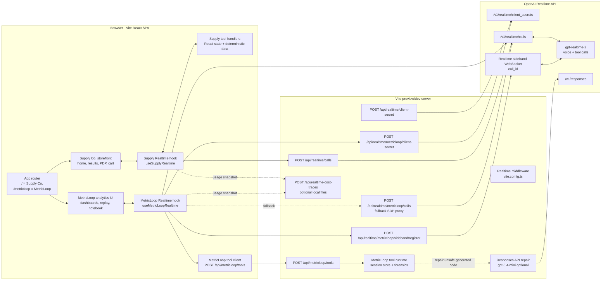
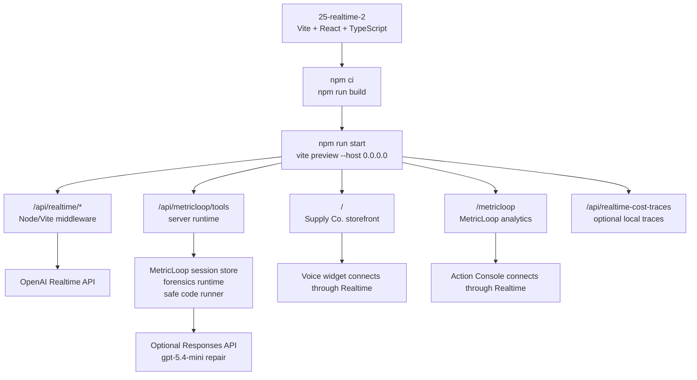
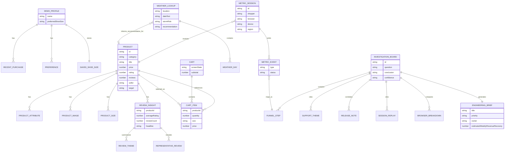
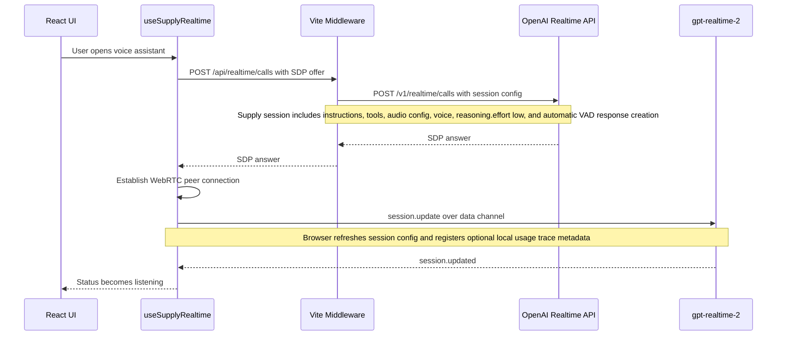
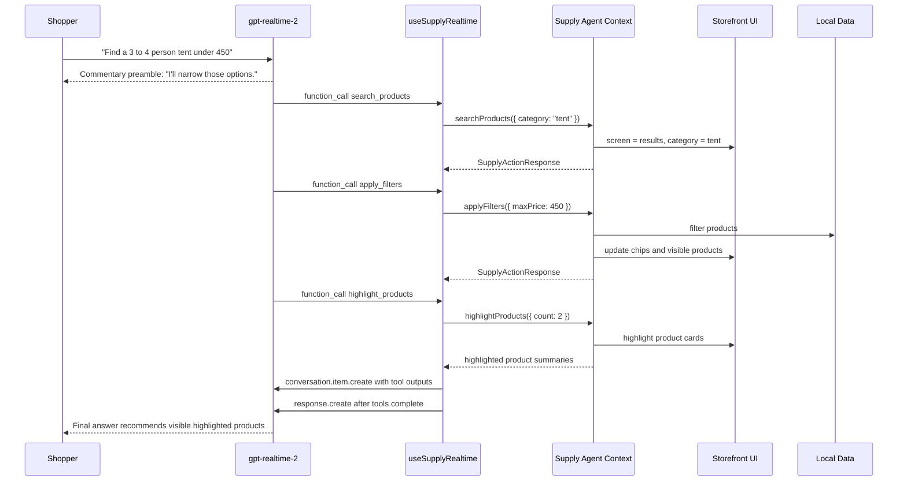
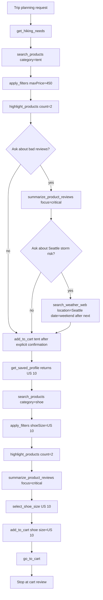
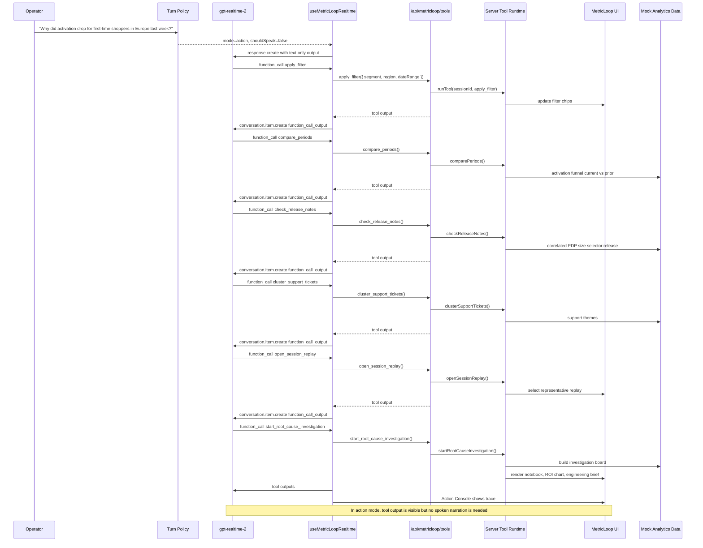
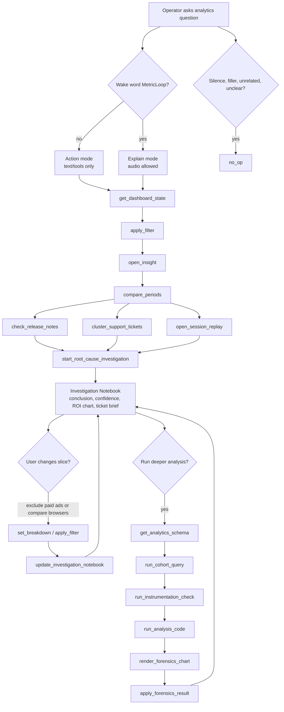
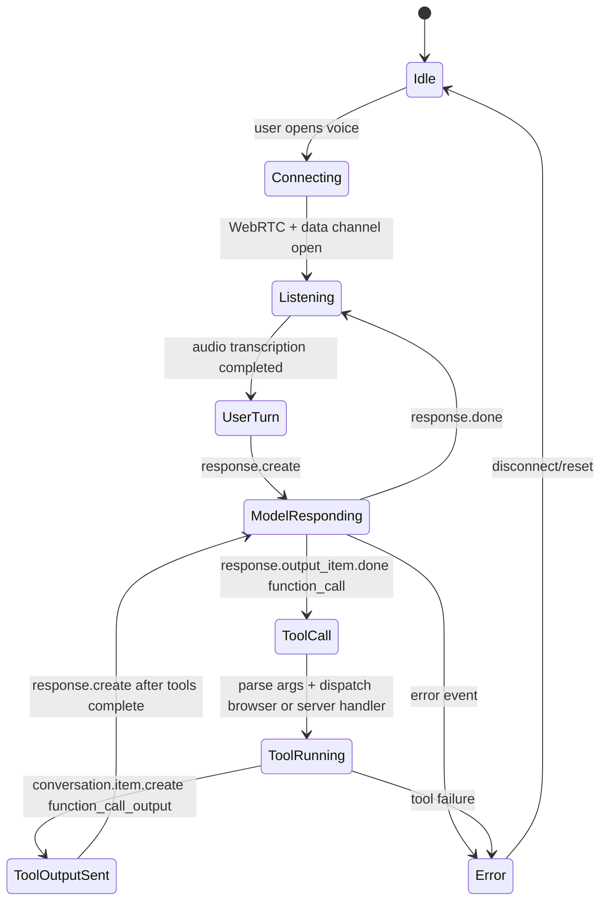

# Supply Co. and MetricLoop Developer Architecture

This document explains how the two demo surfaces work together:

- **Supply Co.** is the shopper-facing voice commerce app.
- **MetricLoop** is the operator/developer analytics surface that investigates what happened after voice shopping sessions.

Both surfaces live in the same Vite React app and use OpenAI Realtime with strongly scoped tool definitions. Supply Co. uses browser-local deterministic tools for storefront state. MetricLoop routes tool calls through the local Vite server so analytics state, cohort forensics, safe generated-code execution, optional repair, and report updates have a server-owned boundary. The Realtime 2 prompting guidance recommends explicit tool policy, preambles, entity capture, and low reasoning effort for responsive voice agents; this app applies that pattern with `gpt-realtime-2` and `reasoning.effort = "low"`.

## Runtime Architecture



## Runtime Shape



## ERD - Demo Domain Model

The app does not use a database. These entities are TypeScript objects and React state, with deterministic mock data in `src/data.ts`, `src/demoExperience.ts`, `src/reviewInsights.ts`, `src/weatherSearch.ts`, and `src/metricloop/*`.



## Supply Co. Realtime Session Setup



## MetricLoop Realtime Session Setup

```mermaid
sequenceDiagram
  participant UI as MetricLoop UI
  participant Hook as useMetricLoopRealtime
  participant Server as Vite Middleware
  participant OAI as OpenAI Realtime API
  participant Sideband as Server Sideband
  participant Model as gpt-realtime-2

  UI->>Hook: User opens Lighthouse
  Hook->>Server: POST /api/realtime/metricloop/client-secret
  Server->>OAI: POST /v1/realtime/client_secrets
  Note over Server,OAI: Request includes short expiry, MetricLoop session config, and OpenAI-Safety-Identifier
  OAI-->>Server: client_secret.value
  Server-->>Hook: Ephemeral client secret
  Hook->>OAI: POST /v1/realtime/calls with SDP offer and client secret
  alt Direct browser call succeeds
    OAI-->>Hook: SDP answer + Location call id
    Hook->>Server: POST /api/realtime/metricloop/sideband/register
    Server->>Sideband: Open WebSocket with call_id
    Sideband<->>Model: Attach to same Realtime session
  else Direct browser call fails
    Hook->>Server: POST /api/realtime/metricloop/calls with SDP offer
    Server->>OAI: POST /v1/realtime/calls with server API key
    OAI-->>Server: SDP answer
    Server-->>Hook: SDP answer
  end
  Hook->>Hook: Establish WebRTC peer connection
  Hook->>Model: session.update over data channel
  Note over Hook,Model: MetricLoop keeps turn_detection.create_response=false; the app decides when to send response.create
  Model-->>Hook: session.updated
  Hook-->>UI: Status becomes listening
```

## Supply Co. Tool-Call Flow



## Supply Co. Happy Path Tool Map



## Supply Co. Tool Catalog

| Tool | Purpose | Reads/Writes |
|---|---|---|
| `get_hiking_needs` | Returns missing gear for the weekend trail kit | Read-only deterministic response |
| `get_saved_profile` | Returns the demo shopper, saved US 10, preferences, recent purchases | Read-only deterministic profile |
| `get_screen_state` | Captures current screen, filters, cart, visible products, safe targets | Read-only React state |
| `search_products` | Navigates to results and sets active category | Writes React screen/category state |
| `apply_filters` | Applies max price, shoe size, shipping, Supply-ready, sort | Writes filter state |
| `highlight_products` | Highlights cards/targets and returns selected product summaries | Writes highlight state |
| `open_product` | Opens PDP from product id, target id, or visible index | Writes selected product/screen state |
| `select_quantity` | Sets PDP quantity | Writes quantity state |
| `select_shoe_size` | Selects US shoe size on PDP | Writes selected shoe size |
| `open_size_guide` | Opens the PDP size guide | Writes size-guide UI state |
| `close_size_guide` | Closes the PDP size guide | Writes size-guide UI state |
| `add_to_cart` | Adds confirmed item to cart | Writes cart state |
| `summarize_product_reviews` | Summarizes synthetic product reviews | Reads local review insight data |
| `search_weather_web` | Checks weather forecast and storm risk | Calls Open-Meteo with local fallback |
| `go_to_cart` | Navigates to cart review | Writes screen state |
| `go_home` | Navigates to homepage | Writes screen state |
| `clear_filters` | Clears result filters | Writes filter state |

## MetricLoop Tool-Call Flow



## MetricLoop Tool Map



## MetricLoop Tool Catalog

| Tool | Purpose | Reads/Writes |
|---|---|---|
| `get_dashboard_state` | Returns current dashboard, filters, board, replay, safe targets | Read-only UI state |
| `apply_filter` | Updates interaction/date/segment/region/browser/device/event filters | Writes dashboard filter state |
| `open_insight` | Navigates to an insight panel | Writes active view/highlight |
| `set_breakdown` | Sets dashboard breakdown by browser/device/source/search term | Writes chart breakdown |
| `switch_visualization` | Changes chart display type | Writes chart type |
| `open_session_replay` | Selects representative replay evidence | Writes selected replay |
| `compare_periods` | Compares funnel or activation metric windows | Reads deterministic analytics data |
| `check_release_notes` | Finds correlated release notes | Reads mock release data |
| `cluster_support_tickets` | Clusters support themes | Reads mock support data |
| `start_root_cause_investigation` | Builds persistent Investigation Notebook artifact | Writes investigation board |
| `update_investigation_notebook` | Updates notebook after filter/breakdown changes | Writes investigation board |
| `get_analytics_schema` | Returns allowed mock warehouse tables, dimensions, and measures | Reads server-side schema contract |
| `run_cohort_query` | Executes a validated cohort query plan over mock warehouse rows | Writes session-scoped result ids |
| `run_instrumentation_check` | Checks event health, missing properties, and validation behavior | Writes session-scoped result ids |
| `run_analysis_code` | Validates and runs generated reducer code over prior result rows | Writes analysis result ids; may request repair |
| `render_forensics_chart` | Builds an inspectable chart artifact from prior result rows | Writes chart artifact |
| `apply_forensics_result` | Applies highest-signal forensics evidence to dashboard filters and notebook | Writes dashboard filters and investigation board |
| `no_op` | Handles silence/filler/unclear/unrelated turns | No UI mutation |

## Realtime Event Handling Pattern



## Key Implementation Notes

- `src/realtimeSessionConfig.ts` centralizes Realtime session shape: model, instructions, tools, `reasoning`, audio transcription, output voice, and optional semantic VAD.
- `vite.config.ts` provides local middleware for Realtime client secrets, WebRTC calls, MetricLoop sideband registration, server-owned MetricLoop tools, optional Realtime cost traces, and optional generated-code repair through the Responses API. Any hosted version must run the Node/Vite server, not a static-only asset server.
- Supply Co. uses `turnDetection.create_response = true` because it behaves like a conversational shopping assistant.
- MetricLoop uses `turnDetection.create_response = false` and manually classifies turns so dashboard actions can be text/tool-only unless the wake word asks for spoken explanation.
- Supply Co. tools are browser-local deterministic functions. MetricLoop tools are invoked through `/api/metricloop/tools`, backed by a local server runtime, mock analytics warehouse, session store, demo-only generated-code validator, and deterministic fallbacks.
- MetricLoop's preferred connection path uses a short-lived client secret for the browser Realtime call and registers a server sideband when a call id is available. The local calls proxy remains as a demo fallback.
- `OPENAI_SAFETY_IDENTIFIER` controls the stable non-PII safety identifier attached to Realtime client-secret creation. `ENABLE_REALTIME_COST_TRACES=1` enables local trace persistence under `output/realtime-cost-traces`.
- The UI intentionally shows tool progress: Supply Co. in the assistant panel; MetricLoop in the Action Console and Investigation Notebook.
- The cart and analytics data are in-memory for the demo. Refreshing the page resets state.
